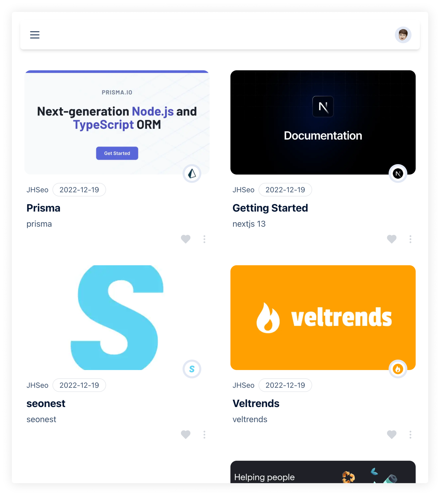

# Blogmark

> Work In Progress

Marking blog site. Like bookmark, but for blog.

## About this project

The beginning of this project is to learn next.js(specially next@13.x), prisma, and other technologies.

Currently it is a personal project, but anyone can use it.

## Features

- OAuth SignIn: Google, Github
- Sites marking

## ScreenShot





## Stack

- [next.js](https://beta.nextjs.org/docs/getting-started)
  - v13.x
  - app directory
- [next-auth](https://next-auth.js.org/)
- [prisma](https://www.prisma.io/)
- [postgresql](https://www.postgresql.org/)
- [cloudflare r2](https://developers.cloudflare.com/r2/)
- [react-query](https://tanstack.com/query/v4), [react-hook-form](https://react-hook-form.com/), [zod](https://zod.dev/)
- ui
  - [tailwindcss](https://tailwindcss.com/)
  - [radix-ui](https://www.radix-ui.com/docs/primitives/overview/introduction)
  - [framer-motion](https://www.framer.com/docs/)
- assets
  - icon: [lucide.dev](https://lucide.dev)

## Running Locally

1. Install deps with [pnpm](https://pnpm.io/).

```bash
pnpm i
```

2. Update environment variables.

```bash
cp .env.example .env
```

3. Run docker compose up -d with .env

```bash
# move to directory where docker-compose.yml is located
cd ./docker/postgresql
docker compose --env-file ../../.env up -d
```

4. Run prisma migrate

```bash
# move to project root directory
npx prisma migrate dev
```

5. Run dev server.

```bash
pnpm dev
```

## Reference

- https://github.com/prisma/prisma-examples
- https://github.com/shadcn/taxonomy

## Todos

- [ ] search
- [ ] dark mode
- [ ] this day / this week / this month pages

## LICENSE

[MIT](./LICENSE)
